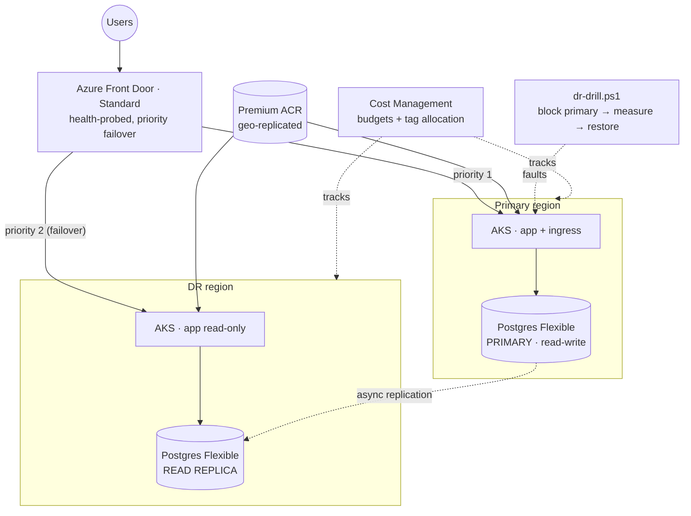

# Azure S3 — Multi-Region DR + FinOps Capstone

The portfolio **finale**: run a Kubernetes workload **active-passive across two Azure regions**, front it with **Azure Front Door** for global routing + automatic failover, replicate the database with a **cross-region Postgres read replica**, geo-replicate the container images, then **prove it works** with a scripted **DR drill** (measured RTO/RPO + written postmortem) and **act on cost** with a quantified **FinOps report**. The technology is table stakes — the point is the **discipline of measuring**: the actual recovery time in seconds, the actual data loss in transactions, and cost recommendations with euro figures next to them.

> Built as a hands-on learning capstone. Deployed for real across two regions (2× AKS + Postgres primary/replica + Premium ACR geo-replication + Front Door Standard), failover **drilled and measured**, a **FinOps right-sizing report** produced with actioned savings, then torn down. This is "SRE / platform engineer reporting RTO/RPO and an annual cost projection to a Director of Engineering" territory.

---

## Architecture



---

## How it works — the resilience layers

| Layer | What it provides |
|---|---|
| **Azure Front Door (Standard)** | Single global entry point; health-probes both origins on `/api/healthz`; routes to the **primary** (priority 1) and **fails over** to DR (priority 2) automatically when the primary probe goes unhealthy |
| **Two AKS clusters** | Identical Helm release in each region; primary serves read-write, DR runs read-only until promoted |
| **Postgres cross-region replica** | Primary in region A, an **async read replica** in region B that follows it; on failover the replica is **promoted** to a standalone read-write server |
| **Premium ACR geo-replication** | One registry, a local replica in each region — each cluster pulls images from its own region (no cross-region pull latency or egress) |
| **DR drill** | A scripted, idempotent, self-cleaning failure injection (NSG block on the primary ingress) that measures **RTO / RPO** and emits a postmortem |
| **FinOps** | Cost Management **budgets** + **tag-based allocation** (`project` / `cost_center` / `region`); a report with three **actionable** right-sizing recommendations in euros |

---

## What gets created

- **Shared** (`rg-s3-shared-*`): a **Premium ACR** geo-replicated to the DR region; **Azure Front Door Standard** (profile + endpoint + origin group + two priority origins + route + health probe); **Cost Management** budget + alerts.
- **Primary region** (`rg-s3-*-<primary>`): VNet, **AKS** (`*_v2` B-series nodes), **Postgres Flexible Server** primary (private, VNet-integrated), **Key Vault**; ingress-nginx + cert-manager (Let's Encrypt over `sslip.io`); the app Helm release (read-write).
- **DR region** (`rg-s3-*-<dr>`): VNet, **AKS** (`*_v2` B-series), **Postgres Flexible Server read replica** following the primary, **Key Vault**; the same app Helm release in **read-only** mode (POSTs return `503` until promoted).
- **Capstone documents** (pinned to the repo): `ARCHITECTURE.md`, `RUNBOOK.md`, `COST-PROJECTION.md`, plus a dated **DR-drill postmortem** and **FinOps report**.

---

## Repository layout

```
terraform/
  shared/        Premium ACR (geo-replicated) + Cost Management budget
  primary/       primary stack: RG, VNet, AKS, Postgres primary (public+fw), Key Vault
  dr/            DR stack: RG, VNet, AKS, Postgres read replica, Key Vault
  frontdoor/     Front Door Standard: endpoint, origin group, two priority origins, route
app/             notes API (Node + pg): /api/healthz, /api/whoami, /api/notes (READ_ONLY gate)
charts/notes/    app Helm chart, parameterized by region (readOnly flag for DR)
k8s/             Let's Encrypt ClusterIssuer (applied to both clusters)
scripts/
  dr-drill.ps1     scale primary to 0 → measure RTO/RPO via Front Door → restore → postmortem
  finops-report.ps1  pull Cost Management data → tag breakdown → recommendations
  promote-replica.sh manual Postgres replica → standalone promotion
docs/
  ARCHITECTURE.md      1-page architecture summary
  RUNBOOK.md           1-page failover runbook
  COST-PROJECTION.md   1-page annual cost projection
  DR-DRILL-<date>.md   measured drill outcomes + 5-Whys postmortem
  FINOPS-REPORT-<date>.md  cost breakdown + 3 actioned recommendations
  ADRs/                architecture decision records (Front Door tier, cold-vs-hot DR, async replication)
```

---

## Prerequisites

- **Owner** on the subscription (VS Enterprise), **Azure CLI**, **Terraform**, **kubectl**, **Helm**.
- A tfstate backend (`rg-tfstate` / `sttfstate…`) — the DR stack reads the primary's outputs via `terraform_remote_state`.
- Two regions that both support **Postgres Flexible Server** + the sub's allowed **`*_v2` B-series** VM SKUs (see *Issues we hit* — earlier projects were forced to `swedencentral`).
- A cross-region **read-replica-capable** region pair (the replica region must accept a replica sourced from the primary).

---

## Setup

**1 — Shared (ACR + Front Door + budget)**
```powershell
cd terraform/shared
terraform init -backend-config=backend.hcl   # key = s3-shared.tfstate
terraform apply
```

**2 — Primary region**
```powershell
cd ../primary
terraform init -backend-config=backend.hcl   # key = s3-primary.tfstate
terraform apply
```

**3 — DR region (reads the primary's Postgres id via remote state)**
```powershell
cd ../dr
terraform init -backend-config=backend.hcl   # key = s3-dr.tfstate
terraform apply
```

**4 — Deploy the app to both clusters**
```powershell
helm --kube-context primary upgrade --install notes ./charts/notes -n app --create-namespace  # read-write
helm --kube-context dr      upgrade --install notes ./charts/notes -n app --create-namespace --set readOnly=true
```

**5 — Run the DR drill (measure) and the FinOps report**
```powershell
./scripts/dr-drill.ps1      -OutputReport docs/DR-DRILL-$(Get-Date -Format yyyy-MM-dd).md
./scripts/finops-report.ps1 -OutputReport docs/FINOPS-REPORT-$(Get-Date -Format yyyy-MM-dd).md
```

---

## DR drill — what gets measured

| Metric | Target (SLO) | How it's measured |
|---|---|---|
| **RTO** — detection + reroute | ≤ 15 min | Time from primary going unhealthy to Front Door serving DR |
| **RPO** — data loss | ≤ 5 min | Transactions written to the primary but not yet replicated at cutover |
| Replica → standalone promotion | ≤ 10 min | `promote-replica.sh` wall-clock |
| User-facing `5xx` window | minimal | Continuous probing through Front Door during cutover |

The drill script injects a fault by **scaling the primary `notes` deployment to 0** (its ingress then fails Front Door's `/api/healthz` probe), watches Front Door fail over to DR, checks a marker row on the replica, then **restores** the primary — it is idempotent and self-cleaning (a `finally` block scales the primary back up even if aborted). Every run emits a dated postmortem with a **5-Whys**.

### Measured run (2026-07-03)

| Metric | Target | **Measured** |
|---|---|---|
| RTO — Front Door failover to DR | ≤ 15 min | **17.2 s** |
| RPO — marker row on replica at cutover | ≤ 5 min | **replicated — ~0 loss** |
| Time to restore primary serving | — | **17.7 s** |

Full postmortem: [docs/DR-DRILL-2026-07-03.md](docs/DR-DRILL-2026-07-03.md).

---

## FinOps — measured, then acted on

The report pulls Cost Management data, breaks spend down by the `project` / `cost_center` / `region` tags, and produces **three ranked recommendations** — each with an estimated euro saving, effort, and a **decision** (implemented / planned / rejected-with-reason). Reporting a number is easy; the discipline is **acting** on it and writing down why you rejected the ones you rejected.

---

## Reusability — what to change

| Change | Where |
|---|---|
| Primary / DR regions | `terraform/primary` + `terraform/dr` region vars |
| App image / tags | `charts/notes` values |
| Front Door origins / probe path | `terraform/shared/frontdoor.tf` |
| Budget amount + alert thresholds | `terraform/shared` Cost Management budget |
| Required cost tags | stack `locals.tf` tag maps |
| Drill fault (NSG vs Chaos Studio) | `scripts/dr-drill.ps1` |

---

## Security notes

- **Private data plane** — both Postgres servers are VNet-integrated with no public access; the replica inherits the same isolation.
- **No registry admin user** — ACR admin account disabled; clusters pull via managed identity / workload identity.
- **TLS everywhere** — Front Door serves HTTPS and redirects HTTP; origins terminate Let's Encrypt certs; minimum TLS 1.2.
- **Read-only DR** — the DR app rejects writes (`503`) while Postgres is a replica, preventing split-brain before an explicit promotion.
- **Least-privilege secrets** — DB credentials live in per-region Key Vaults, surfaced to pods via the CSI Secrets Store driver, never baked into images.

---

## Best practices demonstrated

- **Measured resilience** — RTO/RPO are *demonstrated numbers from a drill*, not aspirational claims.
- **Active-passive with automatic failover** — the canonical multi-region pattern (health-probed Front Door + priority origins).
- **Asymmetric cost by design** — DR runs lean (replica + smaller node pool) and only goes hot for a drill or a real failover.
- **FinOps as a loop** — allocate by tag → review → recommend → *act* → re-measure, with rejected recommendations documented.
- **Operational discipline** — idempotent, self-cleaning drill automation; a runbook; ADRs; dated postmortems.

---

## Real-world scenarios where this pattern applies

- **Regulated / customer-facing SaaS** — a documented, drilled DR posture is an audit and enterprise-sales requirement (SOC 2, ISO 27001, "what's your RTO/RPO?").
- **Regional-outage resilience** — surviving the loss of a whole Azure region without a heroic manual scramble.
- **Cost-accountable platform teams** — tag-based allocation makes every euro attributable to a `cost_center`, and right-sizing is an ongoing practice, not a one-off.
- **Executive reporting** — the capstone documents (architecture, runbook, annual projection) are exactly what a Director of Engineering asks for before signing off on production.

---

## Cost

> ⚠️ **Multi-region doubles many costs, and Front Door + two AKS clusters are the traps.** Run it **hot only for the build + drill + report in a single week, then destroy.** Never leave both regions and Front Door running.

| Resource | Cost |
|---|---|
| 2× AKS (`*_v2` B-series, small node pools) | ~30 €/mo if both left 24/7 → a few € per session |
| 2× Postgres Flexible (primary + replica, Burstable) | ~25 €/mo → a few € per session |
| **Front Door Standard** | ~30 €/mo + per-request → cents per session |
| Premium ACR (required for geo-replication) | ~13 €/mo → prorated to cents per session |
| Cross-region replication egress | a few € |
| Cost Management budgets / Key Vault | ~0 € |

> Front Door **Premium** (managed WAF, bot rules) is ~280 USD/mo — this lab uses **Standard** (same routing/failover flow) and documents the trade-off in an ADR, exactly as you'd justify it in a real cost review.

`terraform destroy` in `dr` → `primary` → `shared`, then confirm no `rg-s3-*` groups remain → spend returns to ~€0.

---

## Issues we hit (and how we fixed them)

- **Only one viable EU region pair.** This subscription can run the required `Standard_B2s_v2` nodes in **`swedencentral`** and **`polandcentral`** only — West Europe is `NotAvailableForSubscription`, and North Europe / Germany / Norway / Italy / UK don't offer `B2s_v2` at all. So the DR pair is `swedencentral` (primary) + `polandcentral` (DR), verified by a `az vm list-skus` scan before provisioning.
- **Read replicas need GeneralPurpose, not Burstable.** Postgres Flexible Burstable tier can't be a replica *source*, so the primary runs `GP_Standard_D2s_v3` (the smallest GP SKU available in both regions).
- **Private cross-region replica was blocked.** A VNet-integrated (private) replica in Poland couldn't reach the private primary in Sweden — `ReadReplicaToSourceServerNetworkBlocked`, because the two regional VNets aren't peered. Rather than add cross-region VNet peering + dual private-DNS links (fragile), both servers use **public access restricted to Azure services** (`AllowAzureServices` firewall rule, `0.0.0.0-0.0.0.0`) — the standard, reliable pattern for cross-region replicas. Documented as a deliberate trade-off.
- **Front Door first-deploy propagation is slow.** After `terraform apply`, the endpoint returned `404` (`X-Cache: CONFIG_NOCACHE`) for ~25 minutes before the route reached the edge — even though the control plane showed everything `Enabled`. It's propagation, not misconfiguration; once live, health-probe failover is fast (**17.2 s** measured).
- **AKS can't be reconfigured mid-start.** Re-applying the primary stack while `az aks start` was still running returned `409 OperationNotAllowed`. Wait for the start operation to finish, then apply.
- **Interrupted apply leaves a state lock.** A `terraform apply` cut off mid-run left a stale blob lease; `terraform force-unlock <id>` clears it.

---

## License

MIT — see [LICENSE](LICENSE).
